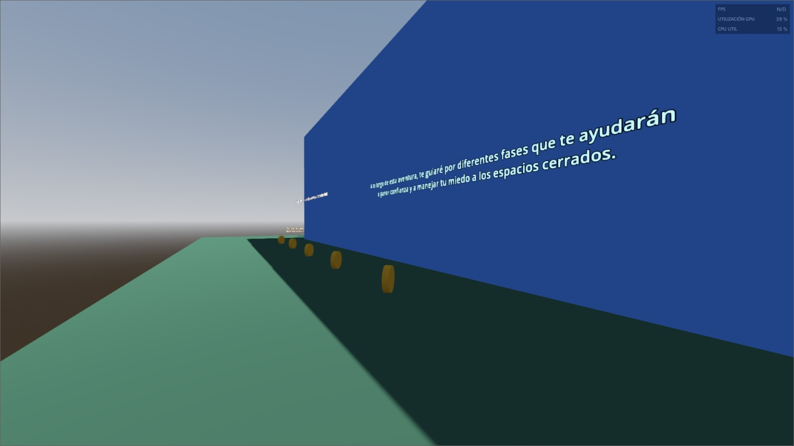
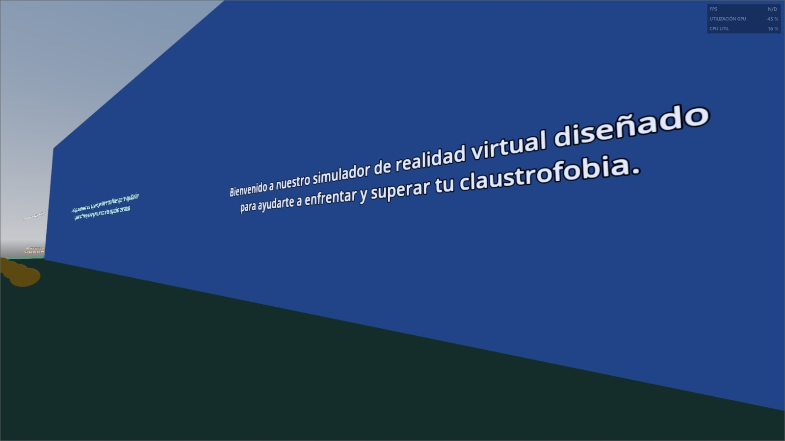
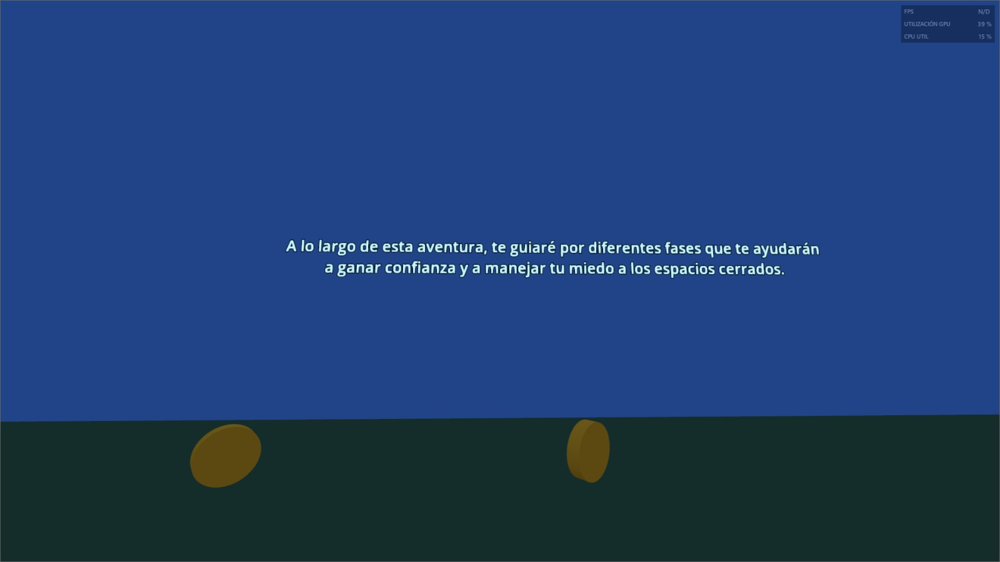
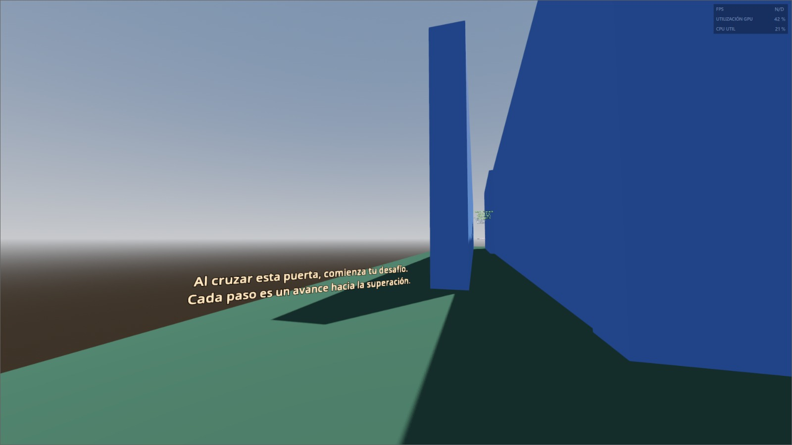
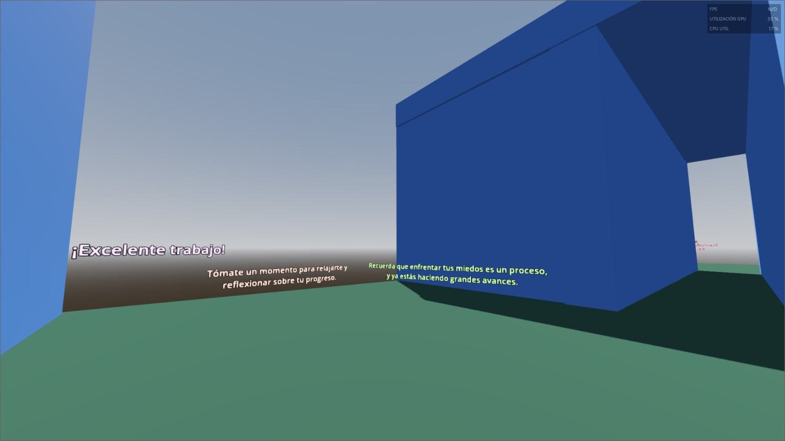
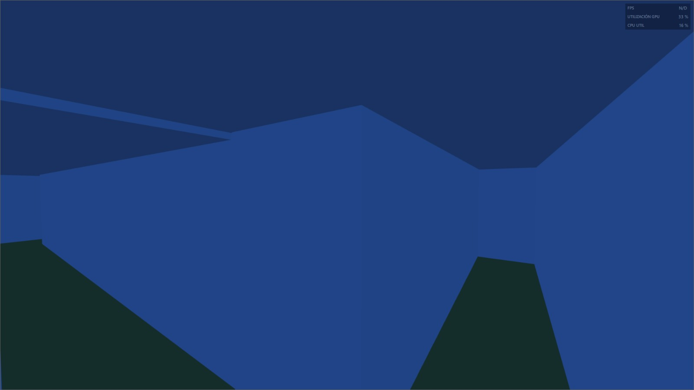
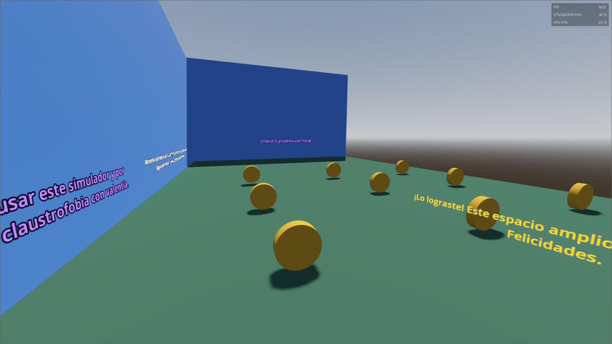
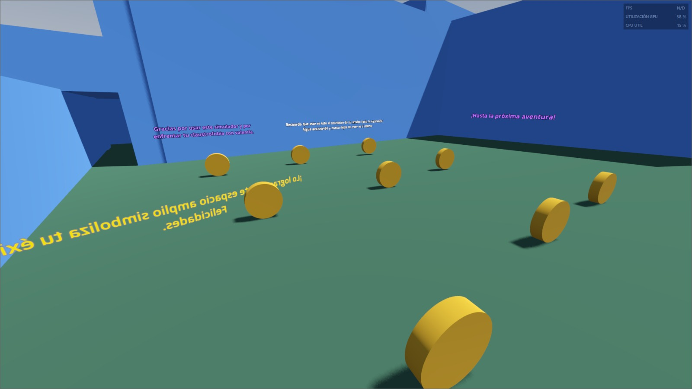

# Proyecto de Videojuego VR para Superar la Claustrofobia

Este proyecto es un videojuego de realidad virtual desarrollado en Godot 4, diseñado para ayudar a los jugadores a enfrentar y superar su claustrofobia. A través de un recorrido por un laberinto con diferentes niveles de dificultad, el jugador experimentará situaciones controladas que incrementan su confianza y capacidad para manejar el miedo a los espacios cerrados.

## Descripción del Proyecto

El juego consiste en una serie de fases progresivas que guían al jugador desde un entorno amplio hasta pasillos cada vez más angostos y oscuros. A lo largo del recorrido, se proporcionan áreas de descanso con mensajes motivadores y de progreso, culminando en una zona amplia que simboliza la superación de la claustrofobia.

## Fases del Juego

1. **Introducción**
   - Presentación del propósito del videojuego y explicación inicial.
2. **Entrada al Laberinto**

   - Comienzo de la aventura con la primera puerta de entrada.

3. **Primer Pasillo**

   - Pasillo largo y angosto, pero alto, para un primer desafío ligero.

4. **Segundo Pasillo**

   - Pasillo más corto pero más angosto, incrementando la dificultad.

5. **Primera Área de Descanso**

   - Zona de descanso con mensajes motivadores.

6. **Pasillos Angostos y Oscuros**

   - Desafío aumentado con pasillos más angostos y techados, en la oscuridad.

7. **Segunda Área de Descanso**

   - Otra zona de descanso con mensajes de progreso.

8. **Decisiones en el Laberinto**

   - El jugador toma sus propias decisiones sobre qué camino seguir.

9. **Meta**

   - Zona amplia que simboliza la superación del miedo.

10. **Despedida**
    - Mensaje de agradecimiento y motivación final.

## Tecnologías Utilizadas

- **Motor de Juego:** [Godot Engine 4](https://godotengine.org/)
- **Lenguaje de Programación:** GDScript

## Instalación y Ejecución

1. **Clona este repositorio:**

   ```sh
   git clone
   ```

2. **Abre el proyecto en Godot 4:**

   - Abre Godot 4.
   - Selecciona "Importar" y navega hasta la carpeta del proyecto clonado.
   - Selecciona el archivo `project.godot` y ábrelo.

3. **Ejecuta el proyecto:**
   - Haz clic en el botón de "Ejecutar" en Godot para iniciar el juego.

## Imágenes del Videojuego

A continuación se muestran algunas imágenes del videojuego en diferentes fases:

### Introducción





### Entrada al Laberinto



### Primer Pasillo



### Pasillos Angostos y Oscuros



### Meta



